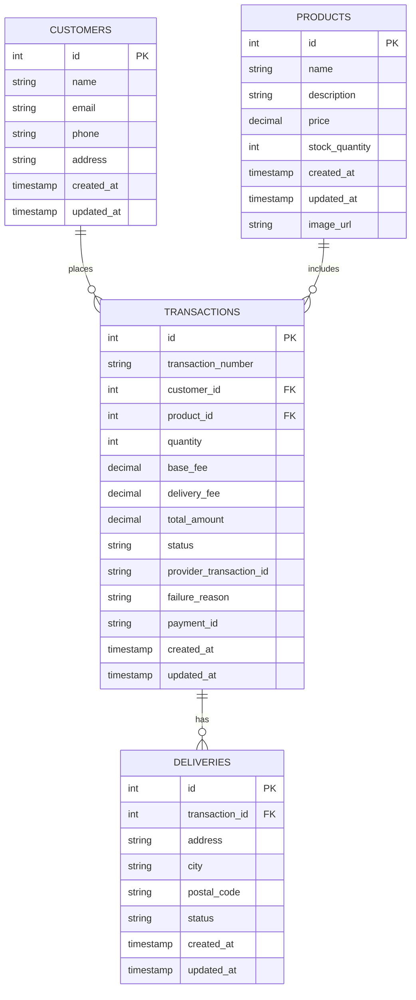

# 🧪 Full Stack Test Project

This is a full stack project built with:

- *Frontend:* React with Redux  
- *Backend:* Ruby with Sinatra  
- *Database:* PostgreSQL  

---

## 📂 Project Structure

```bash
project/
├── frontend/         # ReactJS Application
├── backend/          # API built with Ruby/Sinatra
├── documentation/    # Documentation, diagrams, etc.
└── README.md         # General instructions and documentation
```

---

## 📊 Database Schema (PostgreSQL)


---

## 📂 Frontend Structure (React + Redux)

```bash
project/frontend/src/
├── actions/                    # Redux actions for API and UI events
│   ├── __tests__/
│   ├── productActions.js
│   ├── customerActions.js
│   ├── transactionActions.js
│   └── paymentActions.js
├── reducers/                   # Redux reducers for state managment
│   ├── __tests__/
│   ├── productReducer.js
│   ├── customerReducer.js
│   ├── transactionReducer.js
│   └── index.js
├── components/                 # Reusable UI components
│   ├── Footer/
│   ├── ProductList/
│   ├── ProductDetail/
│   ├── PaymentForm/
│   ├── DeliveryForm/
│   ├── PaymentSummary/
│   └── TransactionResult/
├── pages/                      # Route based pages
│   ├── HomePage.js
│   ├── CheckoutPage.js
│   ├── ProductDetailPage.js
│   └── ResultPage.js
└── App.js                      # Main app component with routing
```

---

## 📂 Backend Structure (Ruby + Sinatra)

```bash
backend/
├── app/
│   ├── controllers/              # HTTP route controllers
│   │   ├── product_controller.rb
│   │   └── transaction_controller.rb
│   ├── models/                   # ActiveRecord models for each entity
│   │   ├── customer.rb
│   │   ├── delivery.rb
│   │   ├── product.rb
│   │   └── transaction.rb
│   ├── repositories/            # Repositories to abstract DB access
│   │   ├── customer_repository.rb
│   │   ├── product_repository.rb
│   │   └── transaction_repository.rb
│   ├── services/                # Business logic and orchestration
│   │   ├── payment_service.rb
│   │   ├── payment_status_service.rb
│   │   ├── result.rb
│   │   └── transaction_service.rb
│   └── config.rb                # Main Sinatra app config
├── config/
│   └── database.yml             # Database configuration (PostgreSQL)
├── db/
│   ├── migrate/                 # Legacy migration files
│   ├── migrations/              # ActiveRecord migration files
│   ├── seeds/                   # Seed data for initial setup
│   └── schema.rb                # Database schema snapshot
├── spec/                        # RSpec test suite
│   ├── controllers/
│   ├── models/
│   ├── repositories/
│   ├── services/
│   └── spec_helper.rb
├── .env                         # Environment variables
├── .rspec                       # RSpec config options
├── app.rb                       # Main application entry point
├── check_db_config.rb           # Script to verify DB connection config
├── db_console.rb                # Simple console access to the database
├── Gemfile                      # Ruby gem dependencies
├── Gemfile.lock                 # Locked versions of the dependencies
├── Rakefile                     # Rake dependencies
├── Seed                         # Seed to create products
└── README.md                    # Project documentation

```
---
## 📬 Postman Collection

To test the API, you can import the Postman collection:

🔗 [Download Postman Collection](./documentation/postman_collection.json)

---
## 🧪 Frontend Tests
Location: .github/workflows/frontend-tests.yml

-Tool: Jest with @testing-library/react

-Trigger: Runs on changes inside the frontend/ directory.


---
## 🧪 Backtend Tests
Location: .github/workflows/backend-tests.yml

-Tool: Rspec

-Trigger: Runs on changes inside the backend/ directory.


---
# 🚀 Deployment Architecture

This project is deployed using Amazon Web Services (AWS), leveraging the following services:

✅ Infrastructure Overview

- EC2 (Elastic Compute Cloud)
    - Hosts the backend Ruby/Sinatra application on a virtual server.
    - OS: Amazon Linux 2023
    - Ruby version: 3.2.7
    - Deployed via SSH and systemd
- RDS (Relational Database Service)
    - Managed PostgreSQL instance used as the backend database.
    - Private access, connected via EC2
    - Configuration stored in config/database.yml
- S3 (Simple Storage Service)
    - Stores product images or static files.
    - Public access or pre-signed URLs
    - image_url column references S3 assets

