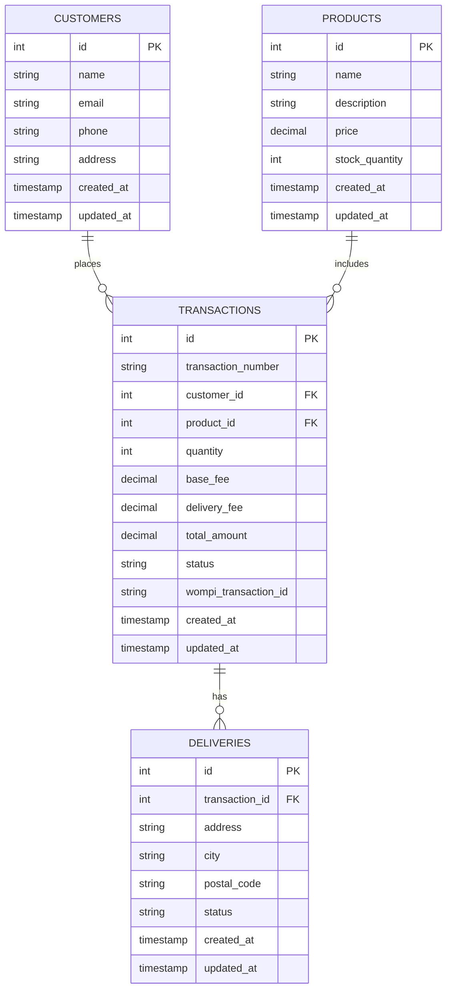

# 🧪 Full Stack Test Project

This is a full stack project built with:

- *Frontend:* React.js  
- *Backend:* Ruby with Sinatra  
- *Database:* PostgreSQL  

---

## 📂 Project Structure

```bash
project/
├── frontend/         # ReactJS Application
├── backend/          # API built with Ruby/Sinatra
├── documentation/    # Documentation, diagrams, etc.
└── README.md         # General instructions and documentation
```

---

## 📊 Database Schema (PostgreSQL)


---

## 📂 Frontend Structure (React + Redux)

```bash
project/frontend/src/
├── actions/                    # Redux actions for API and UI events
│   ├── productActions.js
│   ├── customerActions.js
│   ├── transactionActions.js
│   └── paymentActions.js
├── reducers/                   # Redux reducers for state managment
│   ├── productReducer.js
│   ├── customerReducer.js
│   ├── transactionReducer.js
│   └── index.js
├── components/                 # Reusable UI components
│   ├── ProductList/
│   ├── ProductDetail/
│   ├── PaymentForm/
│   ├── DeliveryForm/
│   ├── PaymentSummary/
│   └── TransactionResult/
├── pages/                      # Route based pages
│   ├── HomePage.js
│   ├── CheckoutPage.js
│   └── ResultPage.js
└── App.js                      # Main app component with routing
```

---
